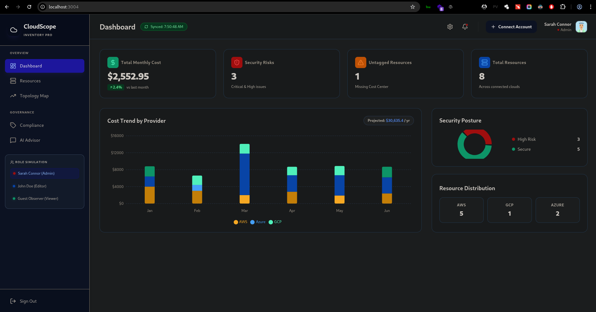

# CloudScope Inventory

<div align="center">
  
</div>

A multi-cloud inventory management dashboard for DevOps and FinOps teams. Track resources, costs, and security compliance across AWS, Azure, and GCP from a single interface.

## Features

- **Multi-Cloud Support** - Unified view of AWS, Azure, and GCP resources
- **Cost Tracking** - Monthly spend analysis and annual projections
- **Security Compliance** - Automated CIS benchmark checks and risk scoring
- **Resource Management** - Tag governance and zombie resource detection
- **Interactive Topology** - Visual infrastructure mapping with D3.js
- **AI Assistant** - Gemini-powered advisor for optimization recommendations

## Tech Stack

- React 18 + TypeScript + Vite
- Tailwind CSS for styling
- Recharts for data visualization
- Google Gemini API for AI features
- Lucide React for icons

## Quick Start

```bash
# Clone and install
git clone <repository-url>
cd cloud-scope-inventory
npm install

# Start development server
npm run dev
```

## Configuration

For AI features, add your Gemini API key:

```bash
# .env.local
VITE_GEMINI_API_KEY=your_api_key_here
```

## Current Implementation

This is a **high-fidelity prototype** using simulated data. The mock service (`services/mockData.ts`) provides:

- Realistic cloud resource data
- Compliance engine with CIS-style checks
- Cost analysis and trending
- RBAC simulation (Admin/Editor/Viewer roles)

## Security Checks

The compliance engine validates:

- **Storage**: Public access, encryption status
- **Compute**: Open ports, public IPs on non-bastion hosts
- **Databases**: Encryption at rest
- **Kubernetes**: Dashboard exposure, RBAC configuration
- **Governance**: Required tagging (Owner, Environment, CostCenter)

## Production Deployment

To deploy with real cloud data:

1. Replace `mockData.ts` with actual cloud SDK calls
2. Implement authentication (OAuth/SAML)
3. Add database persistence
4. Configure monitoring and logging

## License

MIT
